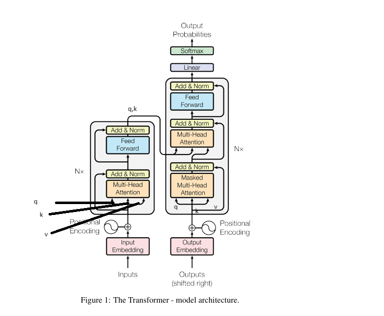
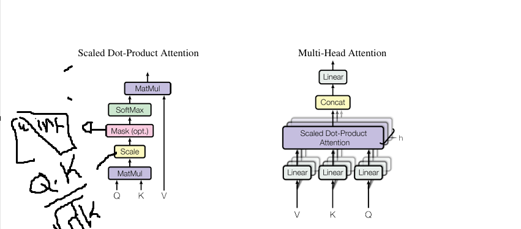

#  Summary of "Attention is All You Need"

## 🔑 Key Concepts

- **Self-Attention**: Allows the model to relate different positions of a sequence to each other in a single step.
- **Multi-Head Attention**: Enables the model to attend to information from different representation subspaces at different positions.
- **Positional Encoding**: Injects sequence order information into input embeddings.
- **Encoder-Decoder Architecture**:
  - **Encoder**: A stack of layers with self-attention + feed-forward networks.
  - **Decoder**: Similar to encoder but includes encoder-decoder attention.
- **Performance**: Achieved state-of-the-art results on English-German and English-French translation tasks with faster training compared to RNN-based models.

---

