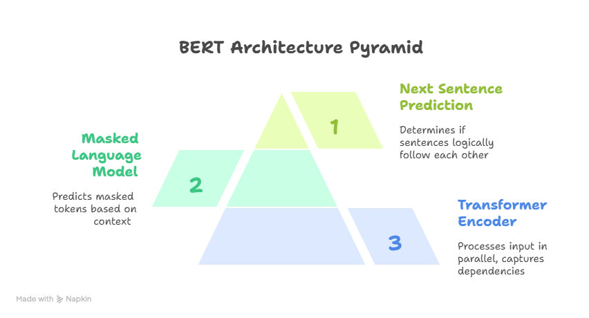
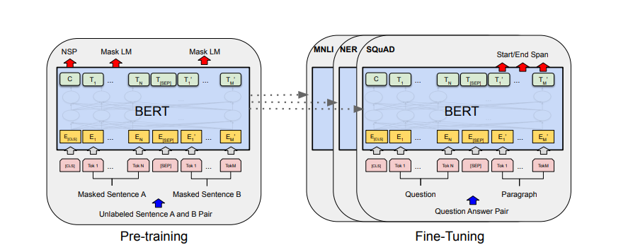
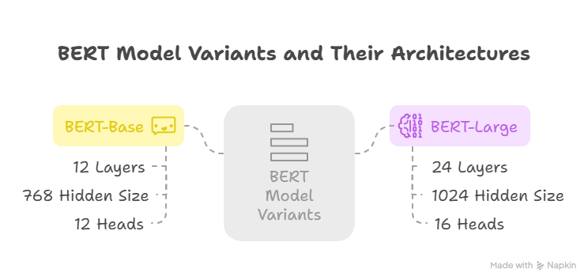

# BERT - Bidirectional Encoder Representations from Transformers

BERT is a powerful language representation model developed by Google. It is based solely on the Transformer architecture and enables deep understanding of language context in a bidirectional manner.

---

##  Core Components

### 1. Transformer (Encoder Only)

BERT is built using the **encoder** stack of the Transformer architecture. The encoder relies on the **self-attention mechanism** to capture relationships between all tokens in a sentence simultaneously.

#### Key Characteristics:
- Processes input in parallel.
- Captures long-range dependencies.
- Understands the context of each word by looking at both its left and right.

---

### 2. Masked Language Model (MLM)

During pretraining, BERT uses the **Masked Language Model (MLM)** objective. It randomly masks some tokens from the input and trains the model to predict those masked tokens based on the surrounding context.

#### Purpose:
- Enables bidirectional context understanding.
- Trains the model to deeply learn the semantics of language.

---

### 3. Next Sentence Prediction (NSP)

BERT also uses the **Next Sentence Prediction (NSP)** objective. Given a pair of sentences, the model learns to determine whether the second sentence logically follows the first one in a document.

#### Purpose:
- Helps the model learn inter-sentence relationships.
- Enhances performance on tasks like Question Answering and Natural Language Inference.

---

##  Summary

| Component | Description |
|-----------|-------------|
| BERT      | A bidirectional language representation model based on Transformers. |
| Transformer (Encoder) | The architecture that powers BERT, using self-attention for contextual understanding. |
| MLM       | Pretraining objective for learning contextual word representations. |
| NSP       | Pretraining objective for learning sentence-level relationships. |

---

##  Pretraining vs Fine-tuning

| Aspect           | Pretraining                                      | Fine-tuning                                  |
|------------------|--------------------------------------------------|----------------------------------------------|
| Objective        | Learn general language understanding             | Adapt the pretrained model to a specific task |
| Data             | Large unlabeled corpus (e.g., Wikipedia, Books)  | Small labeled dataset for a specific task     |
| Tasks            | Masked Language Modeling, Next Sentence Prediction | Sentiment analysis, QA, NER, etc.          |
| Training Time    | Long and resource-intensive                      | Shorter and more efficient                    |
| Reusability      | Produces a general-purpose language model        | Task-specific model                          |

#### Summary:
- **Pretraining** is the phase where BERT learns general language knowledge from massive data using unsupervised tasks.
- **Fine-tuning** adapts this pretrained knowledge to downstream tasks using task-specific labeled datasets.

---
- **Model Variants**:
  - **BERT-Base**: 12 layers, 768 hidden size, 12 heads.
  - **BERT-Large**: 24 layers, 1024 hidden size, 16 heads.
 

##  Reference

[Original BERT Paper ](https://arxiv.org/pdf/1810.04805.pdf)
