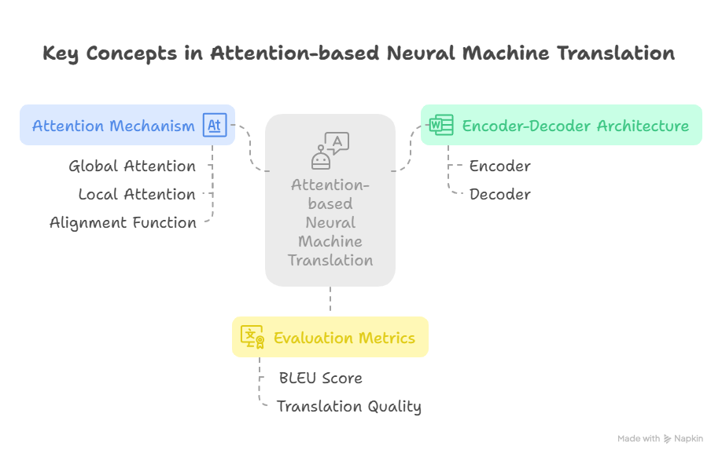

#  Key Terms from the Paper
**Effective Approaches to Attention-based Neural Machine Translation**  
*By Minh-Thang Luong et al.*

---

## 1. Neural Machine Translation (NMT)
A deep learning-based approach to automatically translate text from one language to another using neural networks.

---

## 2. Encoder-Decoder Architecture
A common structure in NMT where:
- The **encoder** processes the source sentence.
- The **decoder** generates the translated sentence.

---

## 3. Attention Mechanism
Allows the model to "attend" to different parts of the source sentence at each step of decoding instead of using a single fixed-length context vector.

---

## 4. Global Attention
An attention mechanism that takes all encoder hidden states into account when generating each target word.

---

## 5. Local Attention
An attention mechanism that focuses only on a subset (window) of encoder hidden states near a predicted alignment position.

---

## 6. Alignment Function
Used to compute attention weights. Types include:
- **Dot**: Simple dot product between decoder and encoder states.
- **General**: Uses a learnable weight matrix.
- **Concat**: Concatenates and feeds through a neural network.

---

## 7. Context Vector
A weighted sum of encoder hidden states based on attention weights — represents the relevant source information at each decoding step.

---

## 8. Bidirectional RNN (BiRNN)
An encoder that reads the input sequence in both forward and backward directions to capture context from both sides.

---

## 9. Soft Alignment
Another name for attention — gives soft (probabilistic) weights to all source words instead of hard selecting one.

---

## 10. BLEU Score
A metric for evaluating the quality of translated text by comparing it to reference translations.

---

## 11. Input-feeding Approach
A technique where the attention-weighted context vector from the previous time step is fed into the next decoder step to improve alignment and translation.

---

## 12. Ensemble Model
Combining multiple models to improve performance. Used in the paper to boost BLEU scores further.

---

## 13. Translation Quality
Assessed through alignment, sentence length handling, and BLEU scores — significantly improved using attention models.

---

## 14. Training Objective
Maximizing the likelihood of the correct translation given the source sentence, using stochastic gradient descent.

---

## 15. Long Sentence Translation
A challenge in NMT that attention mechanisms help solve by providing dynamic context rather than a fixed-length vector.

---
