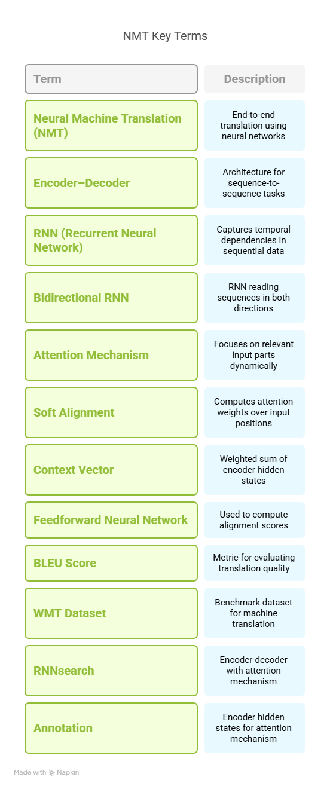

# Key Terms from "Neural Machine Translation by Jointly Learning to Align and Translate"

## 1. Neural Machine Translation (NMT)
Translation approach that uses neural networks to directly model the translation process end-to-end, replacing traditional rule-based or statistical methods.

## 2. Encoder–Decoder
A neural network architecture where the encoder reads and compresses the input sequence into a representation, and the decoder generates the output sequence based on that representation.

## 3. RNN (Recurrent Neural Network)
A type of neural network that is well-suited for sequential data. It maintains a hidden state that is updated at each time step, allowing it to capture temporal dependencies.

## 4. Bidirectional RNN
An RNN that reads the sequence in both forward and backward directions to provide richer context for each time step.

## 5. Attention Mechanism
A technique that allows the decoder to dynamically focus on different parts of the input sequence when generating each word in the output.

## 6. Soft Alignment
The process of computing attention weights over all input positions, enabling the model to "softly" attend to relevant source words at each decoding step.

## 7. Context Vector
A weighted sum of encoder hidden states, representing the relevant information from the source sentence for a particular decoding step.

## 8. Feedforward Neural Network
A simple neural network where information flows in one direction. It is used in the attention mechanism to compute alignment scores between encoder and decoder states.

## 9. BLEU Score
A metric for evaluating the quality of machine-translated text by comparing it to one or more human reference translations.

## 10. WMT Dataset
A benchmark dataset from the Workshop on Machine Translation, commonly used for training and evaluating machine translation systems.

## 11. RNNsearch
The proposed model in the paper that combines the encoder-decoder architecture with an attention mechanism, enabling better performance on long sentences.

## 12. Annotation (in this context)
The hidden states generated by the encoder for each input word, which are used by the attention mechanism to form context vectors.

