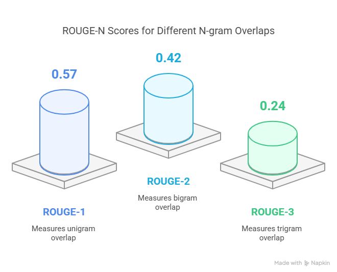
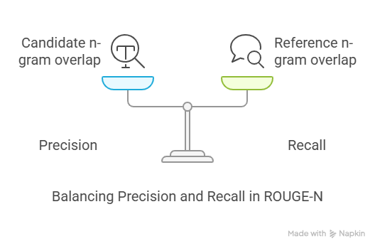
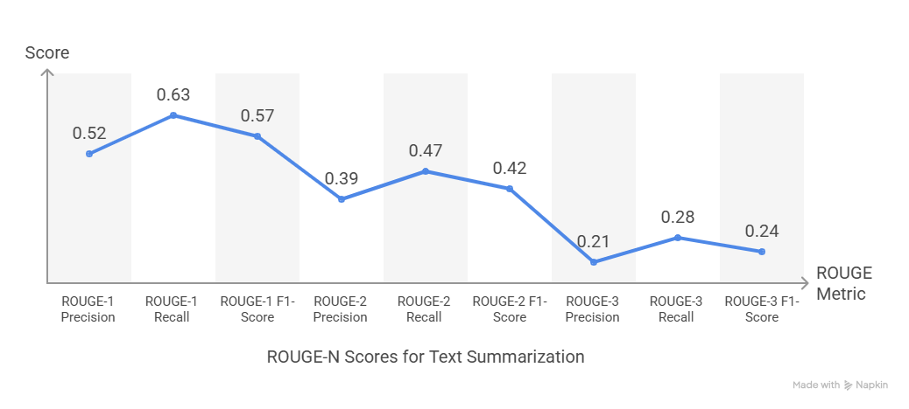

# ROUGE-N Metric

## What is ROUGE?

**ROUGE** stands for **Recall-Oriented Understudy for Gisting Evaluation**.  
It is a set of metrics commonly used to evaluate automatic summarization and machine translation systems by comparing the system output with one or more reference (human) outputs.

---

##  ROUGE-N:

**ROUGE-N** is a variant of ROUGE that measures the overlap of **n-grams** between the candidate text and the reference text.

- **ROUGE-1**: Measures unigram (single word) overlap.
- **ROUGE-2**: Measures bigram (two consecutive words) overlap.
- **ROUGE-N**: Measures n-gram overlap for any n ≥ 1.

---

## Components of ROUGE-N

Each ROUGE-N score consists of:

- **Precision**: Fraction of overlapping n-grams out of all n-grams in the candidate text.
- **Recall**: Fraction of overlapping n-grams out of all n-grams in the reference text.
- **F1-Score**: Harmonic mean of precision and recall.

---

